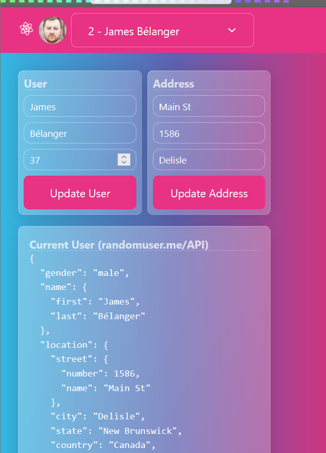

# REACT - Zustand - Nested State Management

    Zustand is a REACT state management tool like redux but much easier, here the objective was to work with nested objects.

|--|--|
|--|--|
| See live demo on vercel: | https://react-zustand-nested.vercel.app |
| See code on github | https://www.github.com/attila5287/react-zustand-nested |
| See Zustand documentation | https://refine.dev/blog/zustand-react-state/#managing-state-structures |
 
 >   Note: the example had a single user as its state, modified it to users array and pulled data from randomuser.me/api so it was mostly like merging two examples from documentation, todo app and nested state structure. Please notice the nested object (from random user API) 

## 📊 Component Analysis

- **SelectUser**: ✅ Gets `users` from store, receives only necessary props
- **CurrentUser**: ✅ Gets `users` from store, receives only necessary props  
- **UpdateUserForm**: ✅ Already clean - only receives form-related props
- **UpdateAddressForm**: ✅ Already clean - only receives form-related props
- **App.jsx**: ✅ Still needs `users` from store for initialization and updates

## 🎯 Zustand Best Practices

This project follows Zustand best practices:

1. **Global state** → Import directly from store
2. **Local state** → Pass as props only when necessary
3. **No prop drilling** → Components get exactly what they need

This is exactly what state management tools like Zustand are designed for - eliminating unnecessary prop passing while keeping the necessary communication between components clean!
